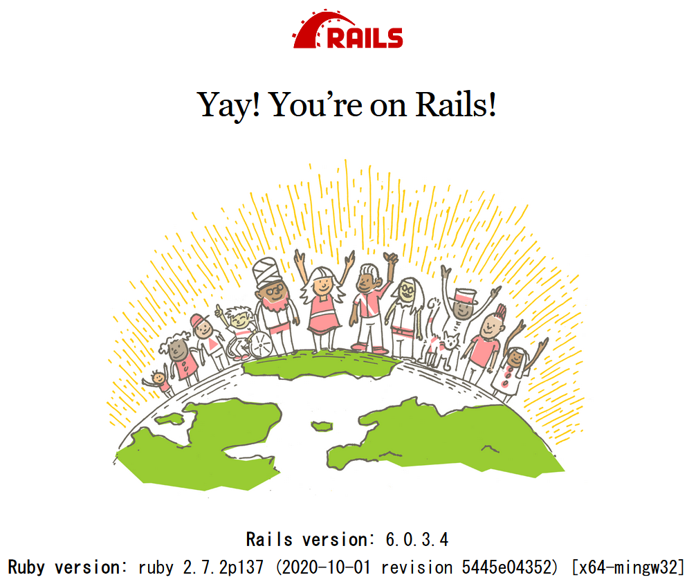

# Auth0 Rails API

## 0. env 

```powershell
PS > ruby -v
ruby 2.7.2p137 (2020-10-01 revision 5445e04352) [x64-mingw32]
PS > rails -v
Rails 6.0.3.4
```

## 1. rails new api mode

```powershell
PS > rails new auth0-rails-api --api
```

full log: [rails-new.log](rails-new.log)  

## 2. rails s

```powershell
PS > cd .\auth0-rails-api\
PS auth0-rails-api> rails s
=> Booting Puma
=> Rails 6.0.3.4 application starting in development
=> Run `rails server --help` for more startup options
*** SIGUSR2 not implemented, signal based restart unavailable!
*** SIGUSR1 not implemented, signal based restart unavailable!
*** SIGHUP not implemented, signal based logs reopening unavailable!
Puma starting in single mode...
* Version 4.3.6 (ruby 2.7.2-p137), codename: Mysterious Traveller
* Min threads: 5, max threads: 5
* Environment: development
* Listening on tcp://[::1]:3000
* Listening on tcp://127.0.0.1:3000
```

browser: http://localhost:3000/  

  

CTRL+C :   

```powershell
Use Ctrl-C to stop
- Gracefully stopping, waiting for requests to finish
=== puma shutdown: 2020-10-20 20:57:53 +0900 ===
- Goodbye!
Exiting
```