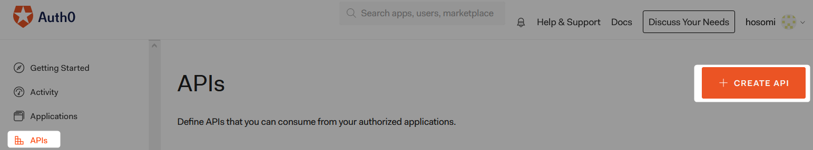
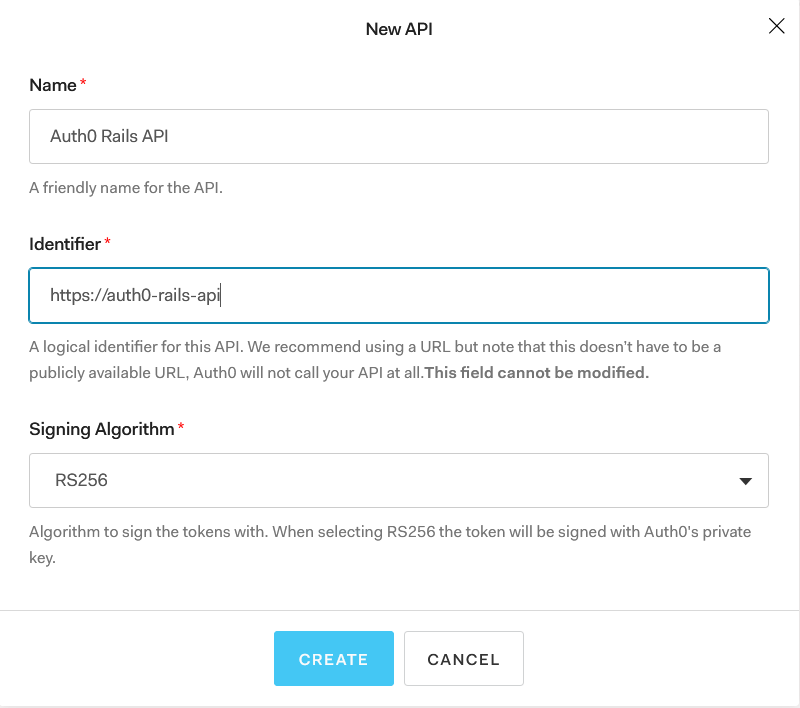
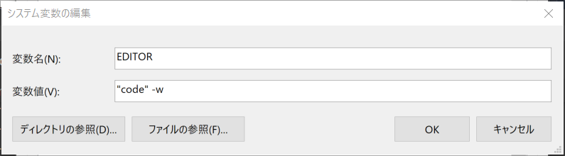

# Auth0 Rails API

## 0. env 

```powershell
PS > ruby -v
ruby 2.7.2p137 (2020-10-01 revision 5445e04352) [x64-mingw32]
PS > rails -v
Rails 6.0.3.4
```

## 1. rails new api mode

```powershell
PS > rails new auth0-rails-api --api
```

full log: [rails-new.log](rails-new.log)  

## 2. rails s

```powershell
PS > cd .\auth0-rails-api\
PS auth0-rails-api> rails s
=> Booting Puma
=> Rails 6.0.3.4 application starting in development
=> Run `rails server --help` for more startup options
*** SIGUSR2 not implemented, signal based restart unavailable!
*** SIGUSR1 not implemented, signal based restart unavailable!
*** SIGHUP not implemented, signal based logs reopening unavailable!
Puma starting in single mode...
* Version 4.3.6 (ruby 2.7.2-p137), codename: Mysterious Traveller
* Min threads: 5, max threads: 5
* Environment: development
* Listening on tcp://[::1]:3000
* Listening on tcp://127.0.0.1:3000
```

browser: http://localhost:3000/  

  

CTRL+C :   

```powershell
Use Ctrl-C to stop
- Gracefully stopping, waiting for requests to finish
=== puma shutdown: 2020-10-20 20:57:53 +0900 ===
- Goodbye!
Exiting
```


## 3. Auth0 API Create

1. APIs 
2. + CREATE API



3. your Name, Identifier




## 4. Create Authorization Handlers

* add gem 'jwt'

Gemfile:  

```Gemfile
gem 'jwt' # add
```

* bundle install

```powershell
PS auth0-rails-api> bundle install
```

full log: [bundle-install.log](bundle-install.log)  


* rails credentials:edit --environment development

```powershell
rails credentials:edit --environment development
Adding config/credentials/development.key to store the encryption key: cc01cf71d7b8bb44fe34fc29622552c8

Save this in a password manager your team can access.

If you lose the key, no one, including you, can access anything encrypted with it.

      create  config/credentials/development.key

Ignoring config/credentials/development.key so it won't end up in Git history:

      append  .gitignore
```

* Tips

```powershell
Tip: If you don't have a default text editor set up in your command line, you may need to pass an EDITOR argument with the command, e.g., EDITOR="vim" bundle exec rails credentials:edit --environment development
```

Windows & Visual Studio Code:  

1. Windows key + Pause/Break key
2. サイドメニューからシステムの詳細設定
3. 環境変数(N)...
4. ユーザ環境変数またはシステム環境変数の新規...
5. 変数名: EDITOR 変数値 "code" -w を設定して OK で閉じる。



コンソールを開き直して  
rails credentials:edit --environment development
をもう一度実行する。  

作成された yml ファイルの内容を Auth0 の設定値に置き換える。

{}.development.yml

```yml
auth0:
  api_identifier: https://auth0-rails-api
  domain: <your-domain>
```

api_identifier: 3. Auth0 API Create で作成した identifier を設定
domain: <account>.auth0.com （account はご自身のアカウント名に置き換えてください。）
